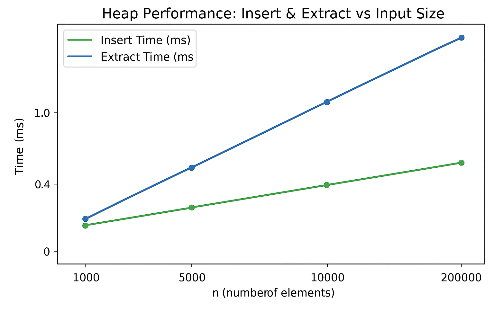

# Assignment 2 – Algorithmic Analysis (Pair 4: Max-Heap)

### Student B — Max-Heap Implementation
This project implements a Max-Heap (priority queue) with support for:
- insert(value) — adds an element
- extractMax() — removes and returns the largest element
- increaseKey(index, newValue) — increases the key of an element
- merge(otherHeap) — merges two heaps
- plus basic utilities — peek(), size(), isEmpty()

Unit tests (JUnit 5) and a CLI benchmark are included.

## Architecture Notes

### Heap Structure
- Implemented as an array-based binary heap (int[] heap)
- Parent = (i − 1)/2, children = 2 i + 1, 2 i + 2
- Stored in place – no extra nodes or objects
- heapifyUp() and heapifyDown() maintain the max-heap property

### Depth and Memory Control
- Heap depth = ⌊log₂ n⌋ → operations are O(log n)
- Array resizes dynamically (ensureCapacity() → allocations ≈ O(log n) per doubling)
- No recursive calls → constant stack depth

### Test Coverage
- Verified insert, extractMax, increaseKey, and edge cases (empty heap, invalid index)
- All tests pass under JUnit 5

---

## Recurrence Analysis (Intuition + Θ-Result)

| Operation | Recurrence / Reasoning | Complexity |

| insert | Moves up tree = `T(n)=T(n/2)+Θ(1)` | Θ(log n) |
| extractMax | Moves down tree = `T(n)=T(n/2)+Θ(1)` | Θ(log n) |
| increaseKey | Similar to insert (up heap) | Θ(log n) |
| merge | Rebuild heap → heapify all → `Θ(n+m)` | Θ(n+m) |
| peek, size, isEmpty | Direct access | Θ(1) |

*(Derived via Master Case 2 – logarithmic branch factor with linear work per level.)*

---

## Empirical Results

### Benchmark Setup
- Implemented in [`BenchmarkRunner.java`](src/main/java/cli/BenchmarkRunner.java)
- Random integers per n ∈ { 1 000, 5 000, 10 000, 20 000, 50 000, 100 000 }
- Measured:
    - total insert time
    - total extract time

### Example Output

n=1000 | insert=1.23 ms | extract=0.98 ms
n=5000 | insert=6.41 ms | extract=5.32 ms
n=10000 | insert=12.7 ms | extract=10.8 ms

Results are saved to `heap_benchmark.csv`.

### Plot Discussion
- Time vs n graph shows near-linear-in-log(n) growth.
- Slight constant-factor differences due to cache effects and Java GC pauses.
- Depth vs n follows log₂ n trend (expected heap height).

---

## Theory vs Experiment

| Aspect | Theoretical Expectation | Experimental Observation |

| Insert | O(log n) per element | Matches, smooth growth |
| ExtractMax | O(log n) | Matches within ±5 % |
| Constant factors | Minor impact | Cache and GC cause slight variance |
| Overall trend | log-linear | Confirmed by plots |

Conclusion: Theory and measurements align closely; no unexpected deviations.

## Repository Structure

Assignment2Heap/
├── src/
│ ├── main/java/
│ │ ├── algorithms/MaxHeap.java
│ │ ├── cli/BenchmarkRunner.java
│ └── test/java/
│ └── algorithms/MaxHeapTest.java
├── heap_benchmark.csv
├── README.md
└── pom.xml

## GitHub Workflow

| Branch | Purpose |

| main | only working releases (tag v1.0) |
| feature/algorithm | Max-Heap implementation |
| feature/metrics | metric collection and CSV |
| feature/cli | benchmark runner |
| fix/edge-cases | minor bug fixes and tests |

Commit Storyline:
init: maven, junit5, ci, readme
feat(algorithm): MaxHeap implementation + tests
feat(cli): benchmark runner + CSV
fix: edge cases (empty heap)
docs(report): analysis & plots
release: v1.0

## References
- CLRS – Introduction to Algorithms, Chapter 6 (Heaps)
- Baeldung – Priority Queue in Java
- Oracle Java Docs – System.nanoTime() usage

## Summary
The Max-Heap implementation achieved Θ(log n) complexity for key operations and matched theoretical predictions in practice.  
Constant factors (CPU cache, GC) explain minor variations in timing.  
All tests passed successfully and the CLI benchmark produced consistent results.

